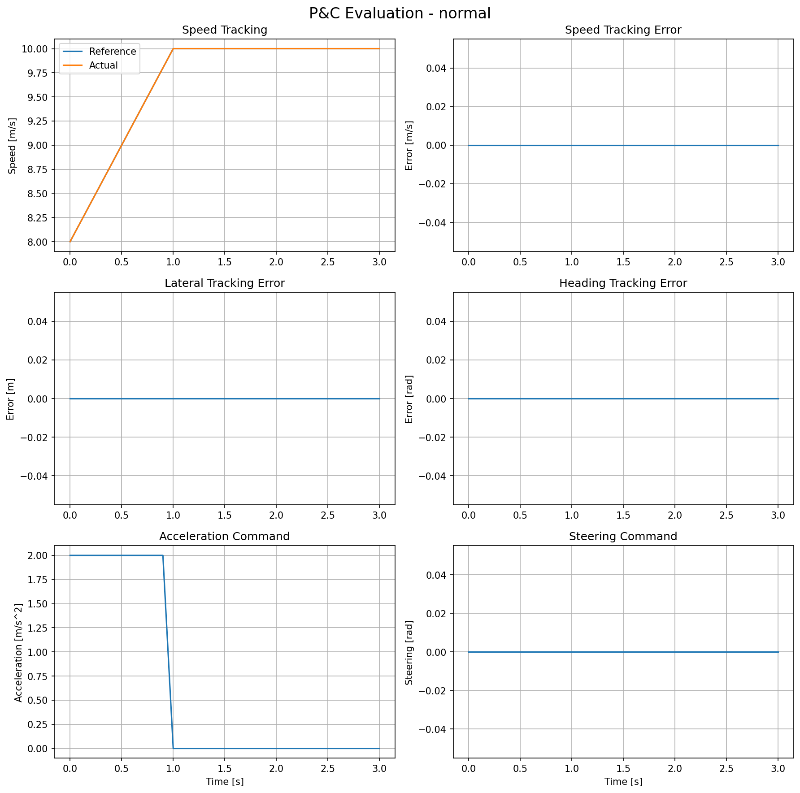
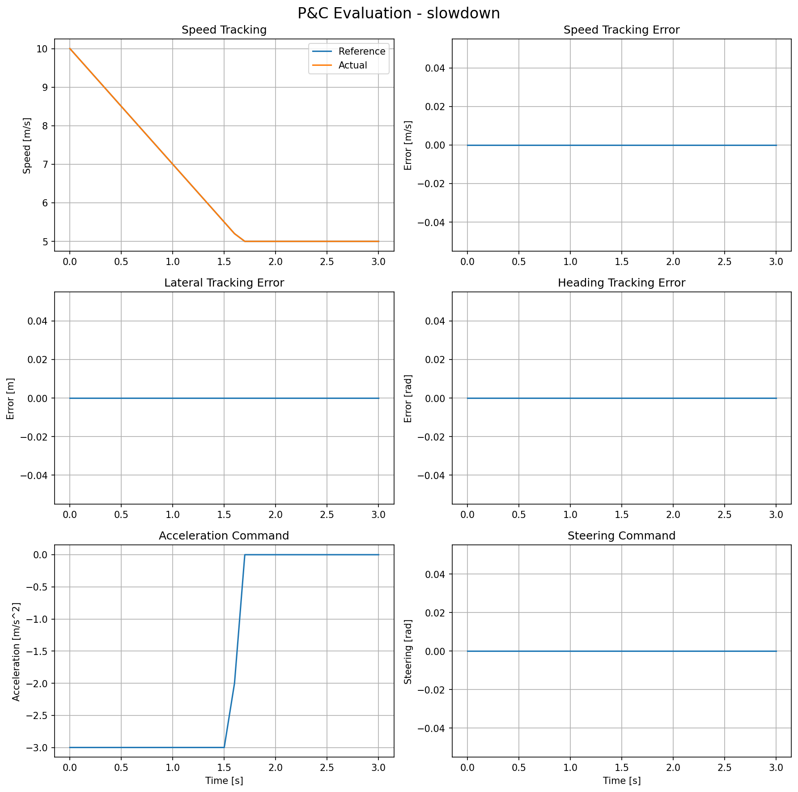
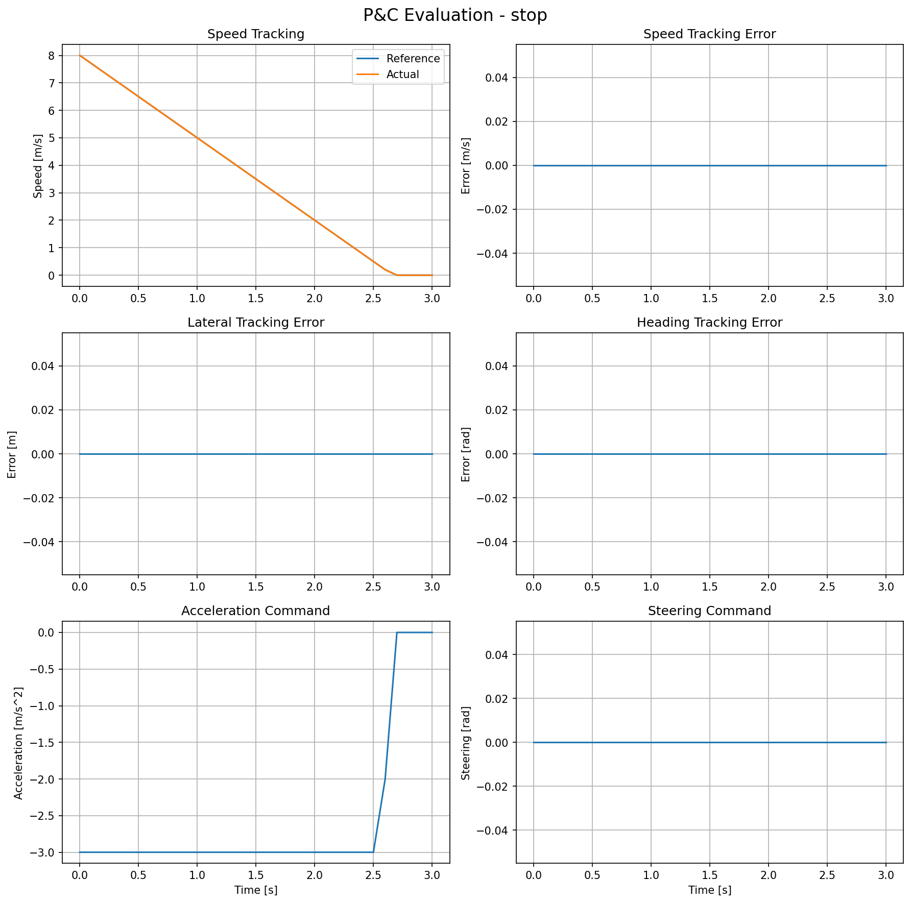

# VLM-Guided Hybrid Autonomous Driving Planner

A modular autonomous-driving Planning & Control portfolio project.

The project starts from a classical Planning & Control baseline and will gradually extend toward trajectory planning, VLM-assisted behavior decision making, deterministic safety checking, dynamic scenarios, C++ migration, and ROS 2 integration.

## Current Status

**Phase 1 — Planning & Control Baseline: Completed**

The current baseline supports:

* Rule-based behavior decisions
* KEEP_LANE / SLOW_DOWN / STOP scenarios
* Straight-line reference trajectory generation
* Longitudinal PID control
* Reference-acceleration feedforward
* Lateral MPC control
* Steering-angle and steering-rate constraints
* OSQP-based quadratic programming
* Kinematic bicycle vehicle simulation
* Closed-loop Planning & Control simulation
* Basic tracking and control evaluation

## System Architecture

```text
Scenario
   ↓
Rule-based Behavior Planner
   ↓
BehaviorCommand
   ↓
Reference Trajectory Generator
   ↓
TrajectoryPoint[]
   │
   ├── reference speed
   │       ↓
   │   Feedforward + PID
   │       ↓
   │   acceleration
   │
   └── lateral / heading error
           ↓
          MPC
           ↓
        steering
           │
           ↓
      ControlCommand
           ↓
   Kinematic Bicycle Model
           ↓
       VehicleState
           └──────── feedback
```

## Phase 1 Scenarios

### KEEP_LANE

The ego vehicle accelerates from 8 m/s to the 10 m/s speed limit while maintaining the reference lane.



### SLOW_DOWN

A slower lead vehicle causes the behavior planner to generate `SLOW_DOWN`, and the reference speed decreases from 10 m/s to 5 m/s.



### STOP

A pedestrian-crossing scenario generates `STOP`. The planner creates a deceleration trajectory from 8 m/s to 0 m/s.



## Longitudinal Control

The longitudinal controller uses reference-acceleration feedforward together with PID feedback:

```text
a_cmd = a_ref + a_feedback
```

where:

```text
a_feedback = PID(v_ref - v)
```

The final acceleration command is limited by the configured acceleration and deceleration bounds.

In the current Phase 1 baseline, the trajectory generator and vehicle model use consistent idealized longitudinal dynamics. Therefore, after adding acceleration feedforward, the simulated longitudinal tracking error is nearly zero.

This is intentionally treated as an ideal baseline rather than as evidence of real-vehicle tracking performance.

## Lateral MPC

The lateral controller uses the error state

```text
x = [lateral_error, heading_error]^T
```

and a linearized kinematic bicycle model.

The discrete prediction model is written as:

```text
X = A_bar x + B_bar U
```

The MPC minimizes a quadratic cost on state error and steering input and converts the optimization problem into a QP:

```text
min  1/2 U^T H U + f^T U
```

subject to steering-angle and steering-rate constraints.

The QP is solved using OSQP.

Only the first steering command in the optimized sequence is applied before solving the MPC problem again at the next control step.

## Evaluation

Phase 1 records and evaluates:

* Speed tracking error
* Lateral tracking error
* Heading tracking error
* Acceleration command
* Steering command
* MAE
* RMSE
* Maximum tracking error
* Steering-rate / smoothness metrics

The three current end-to-end scenarios use straight reference paths, so their nominal lateral error and steering commands are zero.

Non-zero lateral and heading-error recovery is tested separately in the lateral MPC validation script.

## Project Structure

```text
vlm-hybrid-pnc/
├── docs/
│   └── roadmap.md
├── results/
│   ├── normal_summary.png
│   ├── slowdown_summary.png
│   └── stop_summary.png
├── scripts/
│   ├── compare_longitudinal_p.py
│   ├── validate_lateral_mpc.py
│   └── run_pnc_closed_loop.py
└── src/
    ├── behavior/
    ├── common/
    ├── control/
    ├── planning/
    ├── scenario/
    └── vehicle/
```

## Environment

Current development environment:

* Ubuntu 22.04
* Python 3.10
* NumPy
* SciPy
* OSQP
* Matplotlib

## Run

Activate the virtual environment:

```bash
source .venv/bin/activate
```

Run the complete Planning & Control simulation:

```bash
python -m scripts.run_pnc_closed_loop
```

The scenario can be selected in:

```python
SCENARIO_NAME = "normal"
```

Available Phase 1 options:

```text
normal
slowdown
stop
```

Validate longitudinal P-control behavior:

```bash
python -m scripts.compare_longitudinal_p
```

Validate lateral MPC:

```bash
python -m scripts.validate_lateral_mpc
```

## Limitations of Phase 1

The current baseline intentionally uses several simplifications:

* Straight reference paths only
* Ideal kinematic bicycle model
* No actuator delay
* No road slope or external disturbance
* No model mismatch in longitudinal dynamics
* Constant-speed approximation inside each MPC prediction horizon
* Static Phase 1 scenario descriptions
* No vehicle footprint or collision geometry
* No dynamic obstacle simulation

These limitations will be addressed progressively in later phases.

## Next Phase

**Phase 2 — Classical Trajectory Planning**

Planned work includes:

* Reference line representation
* Cartesian ↔ Frenet / SL conversion
* Candidate trajectory generation
* Motion constraints
* Collision checking
* Cost-function-based trajectory selection
* Static obstacle avoidance
* Full Planning & Control integration

See [`docs/roadmap.md`](docs/roadmap.md) for the full development roadmap.
